**End-to-end driving** 

The goal of this project was to use a simulator to collect data of a human driving behavior. This data contains images of three different cameras mounted on top of the vehicle, as well as the steering angle. A convolution neural network should be build, that receives the center image as input and predicts a steering angle to drive the car autonomously. This is a non-trivial regression tasks, therefore a powerful library was needed to realize it. The solutions is Keras, a Deep learning library that provides a high-level neural networks API, in this case for Tensorflow as a backend:

To train the model, a lot of data had to be recorded, augmented and feed into the model for several epochs. The performance is evaluated against a smaller validation set after each epoch. The generated model is saved and used for real-time predictions. For this purpose, a python script receives images from the simulator and then sends the predicted steering angle and speed back to it. The simulator uses that data to drive the car. There are two different tracks available on version 2 of the simulator, and a third one from version 1. The final model was evaluated on all tracks, the results are shown in this writeup.

Version 1 and 2 of the simulator can be found here, both use Unity as game engine: https://github.com/udacity/self-driving-car-sim

This is the result on the second track:

You need **Keras version 1.x** to run this project, with version 2.x there will be an error.

---

**Project files**

The project contains several files to realize the autonomous driving and recording:

The file "model.py" conatains the script to create and train the model, it outputs the trained model afterwards. The file shows the pipeline I used for training and validating the model, and it contains comments to explain how the code works.

Another python script called "drive.py" communicates with the simulator, received images as input for the neural net and sends the steering angle and speed back. The car can be driven autonomously around both tracks by executing "python drive.py model.h5" before entering the autonomous mode on the simulator.

"Model.h5" contains the trained convolutional network, and is the best choice of the several trained epochs. After each epoch, a checkpoint containing the weights and biases plus the model was created, so it was easy to choose the best one afterwards.

Videos of the autonomous mode on all three tracks are stored, called "track1.mp4", "track2.mp4" and "track3.mp4". This is important, because the model may run different on computers with varying hardware configurations. A python script named "video.py" was used, to transform single images recorded during testing to a single video. As the used PC had no GPU, the framerate was reduced to 20FPS.

This writeup file summarizes the results, and it gives a better insight into the used methods and the thoughts behind the project solution.

---

**Model Architecture**

During my work on this project, I used different models, some of them smaller, some larger. I ended with the NVIDIA end-to-end CNN, as it delivers the best results on my training set:

In the first layer, a Keras lambda layer is used to normalize the data between -1 and 1, as well as to center them around zero. This has a big result on the accuracy at the end, so input normalization is always recommended.

The model includes ELU layers after each convolutional or fully connected layer to introduce non-linearity. Using the standard RELU's as activation function has the disadvantage, that they can turn "dead", which means that they are never activated because the pre-activation value is always negative. The so called "Exponential Linear Unit" solves this problem, as for negative values it is a function bounded by a fixes value. In experiments, ELU units seems to learn faster and are preferred in many situations nowadays.

For regularization, I do not use L1 or L2, instead I just focus on Dropout. There is a dropout layer after each convolutional or fully connected layer, except for the output of course. I used 0.2 as drop rate, which means that 20% of the neurons are deactivated during training. Generally, 0.5 is a good value, but then more training data or epochs are needed for the remaining weights to build robust features.

In general, the NVIDIA model consists of five convolutional layer. The first three have a filter size of 5x5, followed by two layers with filter size 3x3. Xavier initializer is used to init the weights on each layer. The first three layer use 2x2 subsampling, the last two do not use subsampling.

Afterwards, the data is flattened (1152 neurons) and feed into three fully connected layer. The number of neurons in those layer are 100, 50 and 10, with Xavier initialization and ELU activation. The last neuron predicts the steering angle with no activation function at the end.

Here is a summary of the model architectures, only leaving away the dropout and ELU layers for simplicity:

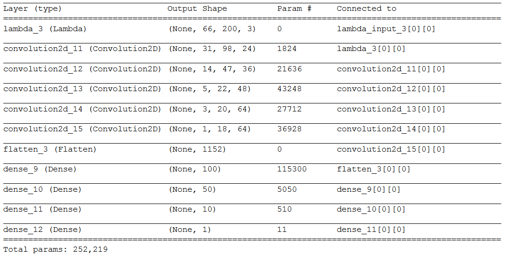

The total number of parameters is around 250.000. It was 1.000.000 before I downsized the image to 200x66, so the resizing operation plays an important role here.

---

**Training Strategy**

The model was trained and validated on different data sets to ensure that the model was not overfitting. For each epoch, the data set was shuffled, and for each batch at the end, too. Dropout is also used to prevent overfitting, with a moderate drop rate of 0.2. The model was tested by running it through the simulator and ensuring that the vehicle could stay on the track.

The model used an adam optimizer, so the learning rate was not tuned manually. This optimizer uses the so called Adam algorithm to control the learning rate. It uses moving averages of the parameters (momentum) to allow a larger effective step size. The algorithm will converge to this step size without fine tuning. 

Training data was chosen to keep the vehicle driving on the road. I used a combination of center lane driving and recovering from the left and right sides of the road on both tracks.

The overall strategy for deriving a model architecture was to have a model, that is complex enough for non-trivial regression task, but not too complex to overfit the data. As already mentioned, I played around with a couple of common infrastructures, including the Comma.ai model. As I do not have access to a GPU at the moment (1080 TI is ordered!), it takes a lot of time to train on the CPU only. In the end, I decided to take the NVIDIA approach described in their paper from 2016, because many other students were doing well with that.

The data set was split to 80% training data and 20% validation data. For the validation data, only the center camera was used, and no image augmentation. This leads to less losses on the validation set, because the data their is easier to predict. The training set uses all three cameras and different augmentation techniques described later. Here are the results of the training history:

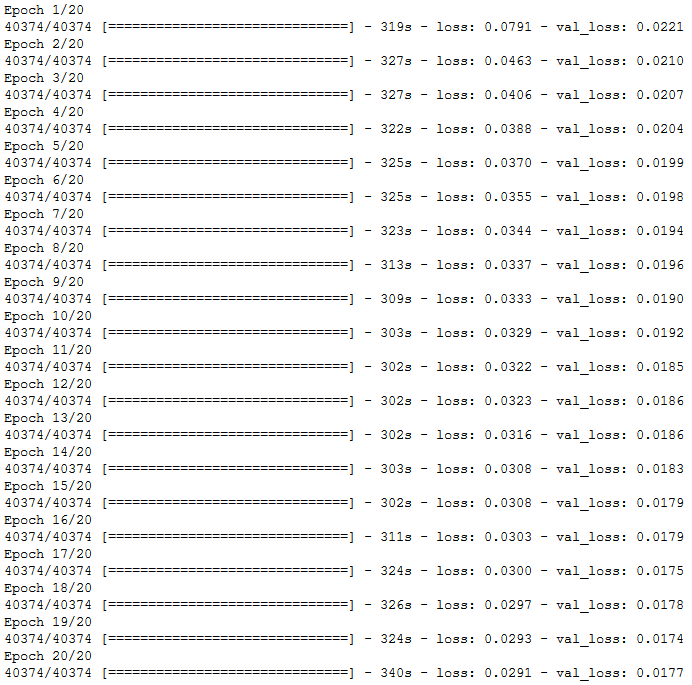

I used early stop technology to see at which epochs the loss on the validation data was not improving any more. That was the case around epoch 20, so I decided to terminate there. At the end, the loss on the validation data was around 0.018 and was decreasing slighty for all epochs:

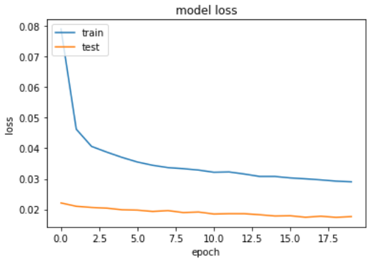

The final step was to run the simulator to see how well the car was driving around. I tried the model the first time after only one epoch of training on both tracks. It completed track 1 without any problems, even mastering the tricky curve after the bridge, where the borders are not clearly visible. On track 2, it fall of on one sharp turn, but it even managed to drive some time there. But to do so at all, I had to add a little amplification factor of 1.5 to the steering angles in the "drive.py" file. That factor also proved to be good for track 3. Otherwise, the turning rates are not strong enough for the tricky curves.

After training 20 epochs, the model was able to drive on both tracks without any error. This shows that it learned to generalize the driving behaviour of the human driver. The results are pretty amazing, because the training data set was not very large, containing some few rounds on the tracks.

To capture good driving behavior, I first recorded two laps on track one using center lane driving. Here is an example image of center lane driving on the first track:

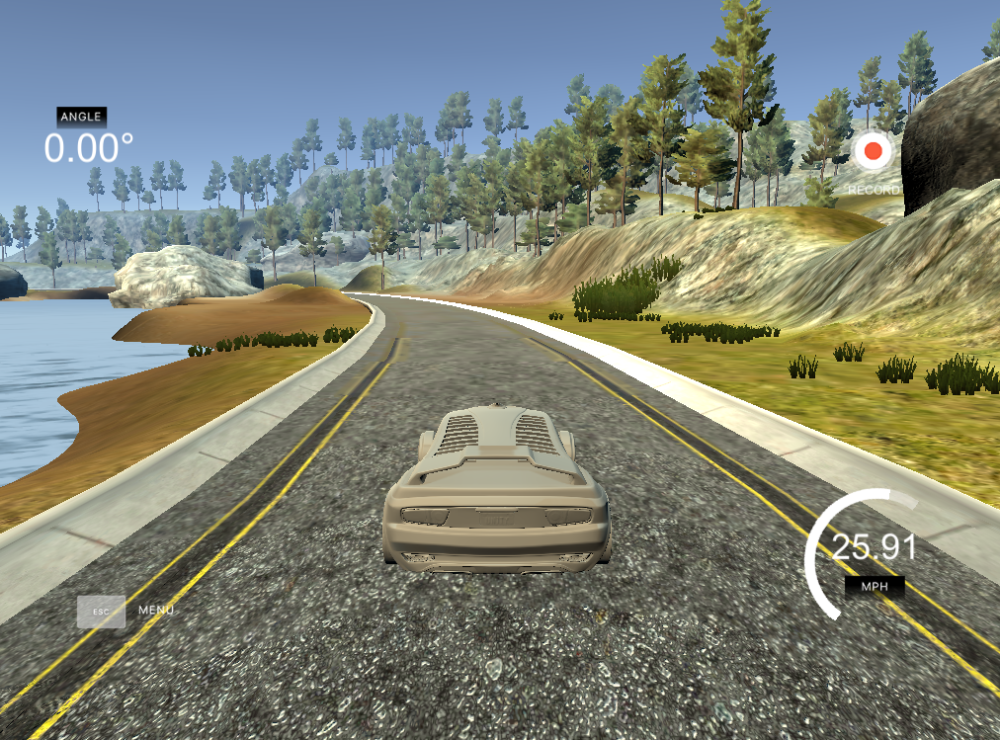

I then recorded the vehicle recovering from the left side and right sides of the road back to center so that the vehicle would learn to steer back towards the middle. These images show what a recovery looks like starting from the left side going to the middle:

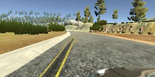
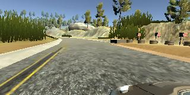

Afterwards, I repeated this process on track two in order to get more data points:

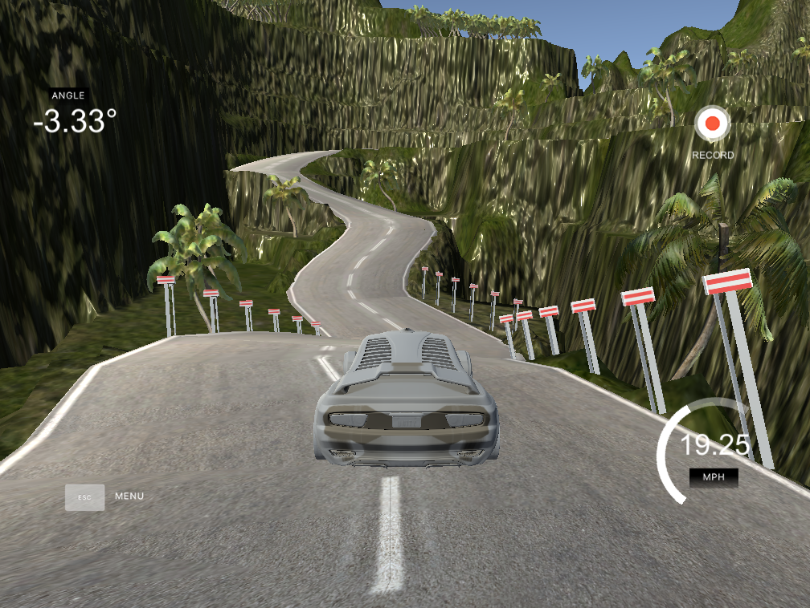

The model was trained on a large dataset of over 40000 images, with a resolution of 200x66 pixel. Data augmentation was applied randomly to the training data set. I used three different kinds of techniques: Flipping, brightness change and shift. 

Flipping mirrors the image around the y-axis. This is important, because the first track has a bias towards left turns, so the network could develop such a bias, too. Of course, the steering angle also has to be inverted, which is done by multiplying it with a negative value of -1. As a result, the histogram of the angles shows this:

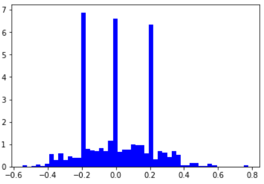

For the brightness change, the color space is first converted from RGB to HSV. Then, a random factor for the change is created, which is in the range of 0.5 to 1.5. So some images will be darkened, and some brightened. This factor is used for multiplication with the value channel, and then the image is converted back to RGB.

The last used technique is random shifting. In x direction, the image is shift up to 50 pixel left or right. This also influences the angle, so a correction factor of 0.004 per shifted pixel is added. In y direction, the shift is -20 to 20 randomly. 

In the next step, the image is cropped, 50 pixels at the top and 20 pixel at the bottom. The information there is not needed and may rather confuse the image. To correspond to the NVIDIA approach, the image is afterwards resized to 200x66 pixel. Those two operations of course also have to be added to the "drive.py" script, as it is crucial that the new data is preprocessed in the same way. An input image looks like this:

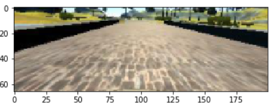

---

**Test results**

The first track was easy to handle at the standard speed of 15, so I tried how fast I can go. 30 was too fast for the low refresh rate of my PC without a GPU, so I settled at 25. I had to add a little damping factor to the steering angles of 0.75, otherwise it would overshoot. A difficult turn on track 1 is this one:

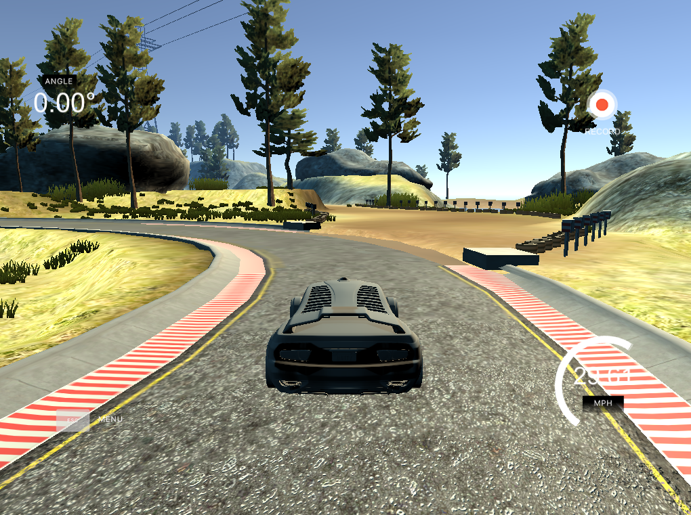

Because there is some sand on the left side and no clean line marking. When I used a less powerful model at the beginning, this was the turn the car did drive straight forward. With the NVIDIA model, even after only one epoch of training, the car took the turn.

For the second track, I slowed the speed down to 15, because there are many sharp turns that even I as a human can not drive any faster. The car made the track without dropping off, even if there were 2-3 situations, that were a little bit critical. 

On the third track from the old simulator, I speeded up again to 25, using the same amplification factor for my car. Even though the neural network has never seen this track before, it mastered it whout any problems or critical situations:

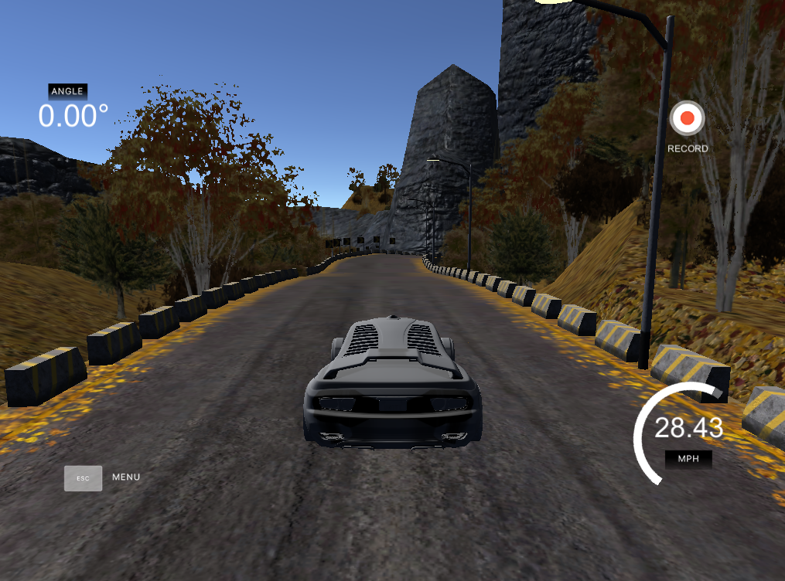

This shows that the trained model is able to generalize very well, and concludes my writeup on this project. I learned a lot and I was a great way to try out different architectures, data augmentation technologies and get fast results.